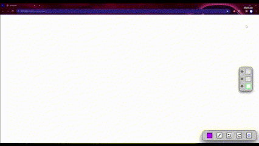
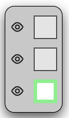
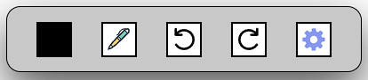
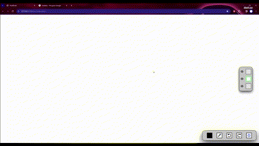
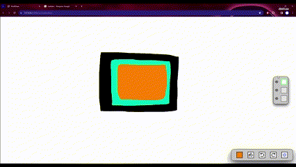
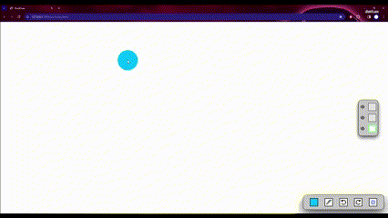
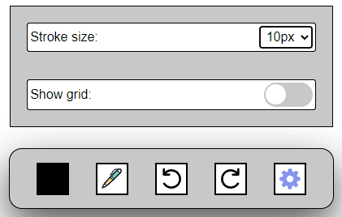
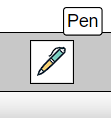
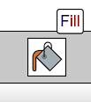

# Sobre este projeto

`Pixel-draw` é um software de ilustração feito com a [Canvas API](https://developer.mozilla.org/en-US/docs/Web/API/Canvas_API) que disponibiliza um ambiente simples e completo para auxiliar artistas e designers. Aqui está um breve guia das suas principais funcionalidades e de como rodar o projeto na sua máquina. 



## Primeiros passos

Para rodar este projeto localmente, siga os passos abaixo:

1. **Clone este repositório:**
    - ```git clone https://github.com/Joao-Vitor-Siqueira/pixel-draw.git```
2. **Navegue até o diretório do projeto:**
    - ```cd pixel-draw```
3. **Execute o programa:**
    - Localize o arquivo `index.html` no diretório do projeto.
    - Abra o arquivo `index.html` com o seu navegador preferido.
  
## Interface de usuário
  
  ### Canvas
  


  - O **Canvas** contém o espaço reservado para a ilustração e ocupa a janela inteira. 
  
  ### Menu de camadas


  
  - O **Menu de camadas** é onde o usuário pode trocar de camadas e ajustar a visibilidade de cada uma.

  ### Menu de ilustração

  
  - As principais funcionalidades estão no **Menu de ilustração**, que contém todas as ferramentas necessárias para auxiliar o processo de ilustração.


## Funcionalidades

### Selecão de cor

- O usuário pode abrir o **Menu de cores** clicando na primeira caixa do **Menu de ilustração** para selecionar uma **Cor** .

### Seleção de ferramenta

- O usuário pode abrir o **Menu de ferramentas** clicando na segunda caixa do **Menu de ilustração** para selecionar uma **Ferramenta** .

### Camadas

- Este sofware disponibiliza 3 **Camadas**, com o objetivo de ajudar a manter a ilustração organizada e limpa.

### Visibilidade de camada

- É possível **esconder** uma **Camada** clicando no ícone de olho ao seu lado.

### Gestão de estados

- Este software possui funcionalidades de **Desfazer** e **Refazer**, que ajudam o usuário a corrigir erros mais facilmente.
- Cada **Camada** terá os seus **Estados** anteriores salvos, deixando o processo de ilustração mais flexível.

### Tamanho de traço 

- O **Tamanho de traço** Pode ser alterado no **Menu de configuração**  (última caixa do **Menu de ilustração**).

### Grade

- Este software possui um filtro de **Grade**, que tem o objetivo de aumentar a precisão do desenho.

## Experiência de usuário e acessibilidade

### Dicas
&nbsp;&nbsp;&nbsp;&nbsp;

- **Dicas** serão mostradas ao passar o mouse em cima de certos itens para fornecer informações sobre suas funcionalidades.

### Atalhos


- <kbd>P</kbd>:  Alternar entre caneta e lápis.
- <kbd>E</kbd>:  Borracha.
- <kbd>G</kbd>:  Balde de tinta.
- <kbd>ctrl</kbd> + <kbd>z</kbd> :  Desfazer.
- <kbd>ctrl</kbd> + <kbd>y</kbd> :  Refazer.