# About this project

`Pixel-draw` is an illustration software made with the 	[Canvas API](https://developer.mozilla.org/en-US/docs/Web/API/Canvas_API) that provides a simple and rich environment to assist artists and designers. Here's a brief overview of its key features and how to get it running on your machine. 

Read this in other languages: [Português](README.PT.md).

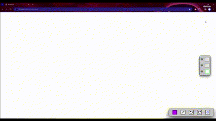

## Getting Started

To run this project locally, follow these simple steps:

1. **Clone this repository:**
    - ```git clone https://github.com/Joao-Vitor-Siqueira/pixel-draw.git```
2. **Navigate to the Project Directory:**
    - ```cd pixel-draw```
3. **Start the program:**
    - Locate the `index.html` file in the project diretory.
    - Open `index.html` with your preferred web browser.
  
## User Interface
  
  ### Canvas
  
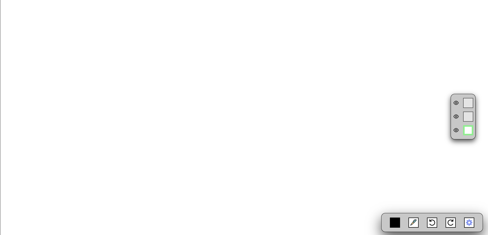

  - The **Canvas** holds the space reserved to the illustration, it takes the entire window. 
  
  ### Layer menu

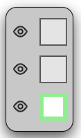
  
  - The **Layer menu** is where the user can switch between layers and toggle their visibility.

  ### Illustration menu

  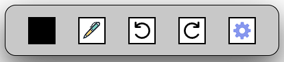
  - The **Illustration menu** is where most of the key features are, it contains all the necessary tools to help with the illustration process.


## Features

### Color selection
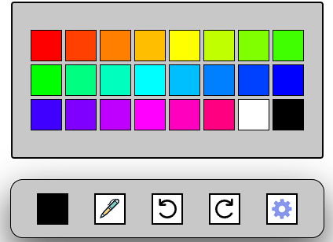
- The user can open the **Color menu** by clicking on the first box of the **Illustration menu** and then select a **Color** .

### Tool selection
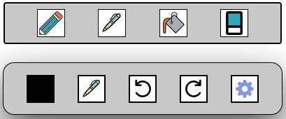
- The user can open the **Tool menu** by clicking on the second box of the **Illustration menu** and then select a **Tool** .

### Layers
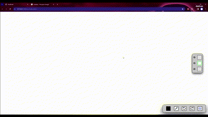
- This software provides access to 3 **Layers**, which can help to keep the illustration organized and clean.

### Layer visibility
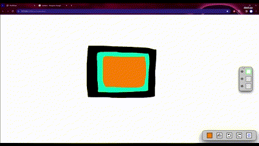
- It's possible to **hide** a **Layer** by clicking on the eye icon right next to it.

### State management

- This software comes with **Undo** and **Redo** functions, which allow the user to correct errors more easily.
- Each **Layer** will keep track of it's previous **States**, allowing more flexibility to the illustration process.

### Stroke size 
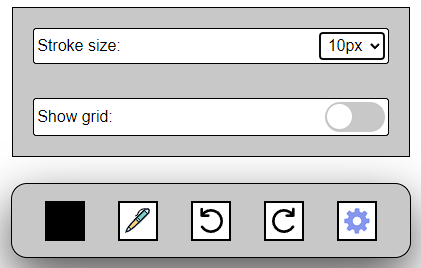
- The **Stroke size** can be changed by opening the **Config menu**  (last box of the **Illustration menu**).

### Grid
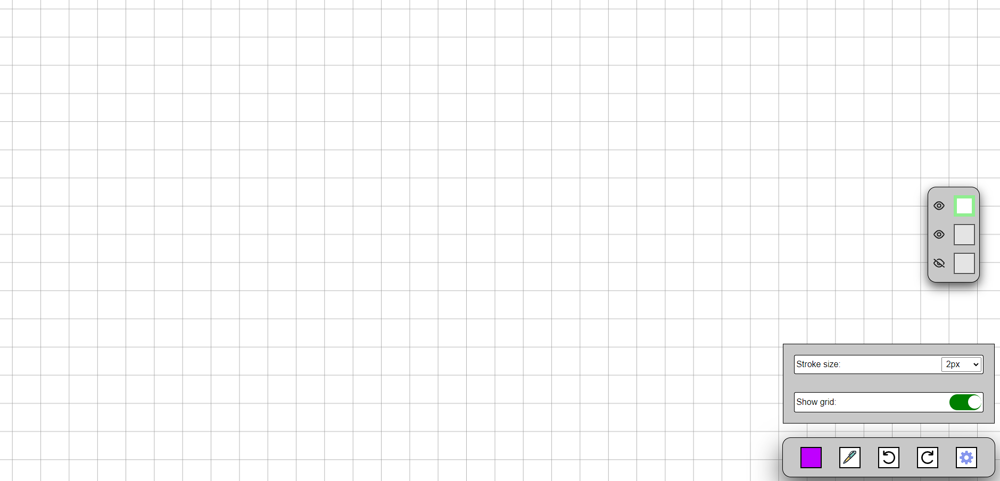
- This software comes with a **Grid** filter, which can allow more precision when drawing.

## UX and Accessibility

### Tooltips
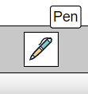&nbsp;&nbsp;&nbsp;&nbsp;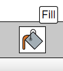

- **Tooltips** will show up on hover for certain items of the interface to provide information about its functionality.

### Shortcuts


- <kbd>P</kbd>:  Switch between pen and pencil.
- <kbd>E</kbd>:  Eraser.
- <kbd>G</kbd>:  Fill.
- <kbd>ctrl</kbd> + <kbd>z</kbd> :  Undo.
- <kbd>ctrl</kbd> + <kbd>y</kbd> :  Redo.


